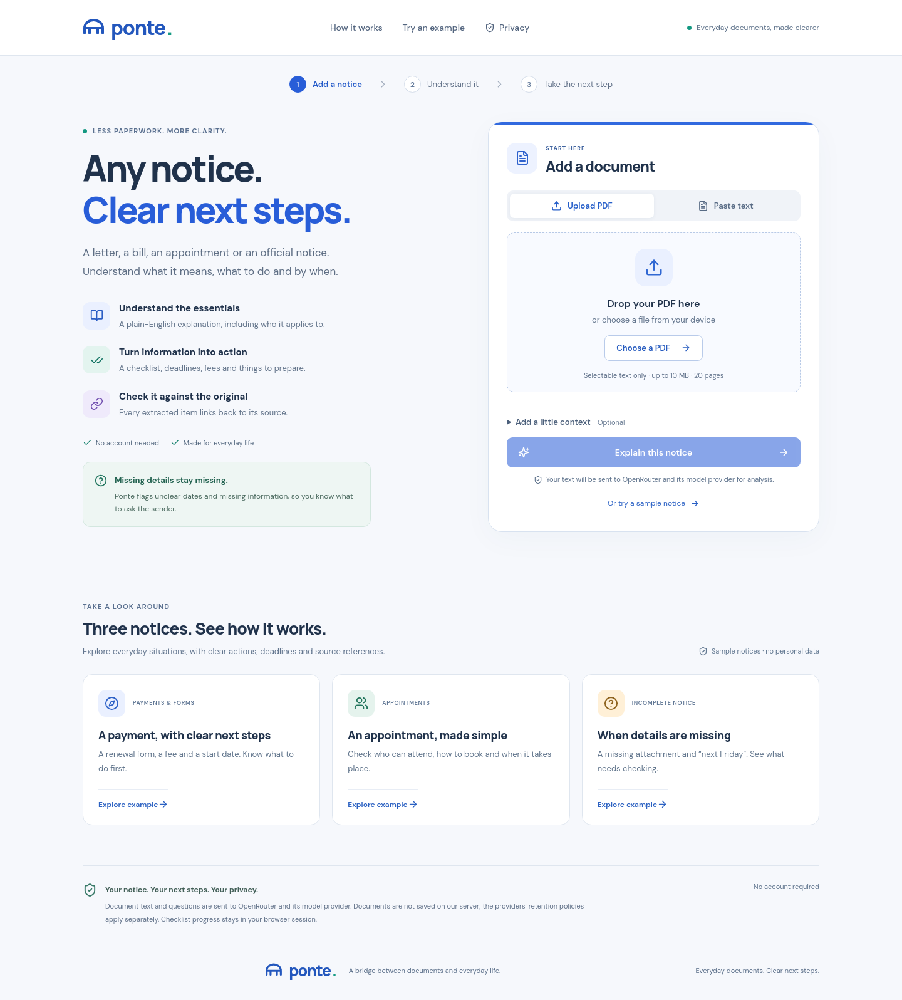

# Ponte

Ponte helps people understand everyday documents and work out what to do next. Upload a PDF or paste its text, and you get an explanation in plain English, a checklist, dates, costs and links back to the original passages.

## Why Ponte exists

A letter can be short and still leave you with a lot of questions. Does it apply to you? Is that date a deadline or an appointment? Do you need to send something back, pay a fee, or simply keep it for your records?

Ponte brings those details together so you can read the document, understand what it asks of you and follow through. It is meant for ordinary paperwork: bills, renewals, appointment letters, forms and official notices. You can use it for yourself or when helping someone else.

The goal is to make the next step easier to understand while keeping the original document close at hand. You should be able to see where an answer came from, and when the document leaves something unanswered.



## What you can do

- **Add a document.** Upload a PDF with selectable text or paste the complete text. You can also say who you are reading for and name a recipient or group.
- **Understand the essentials.** Get a plain-English explanation of what the document says and who it concerns, including conditions that affect what you need to do.
- **Build a checklist.** See the actions, what you need to prepare and any stated deadlines. Tick off tasks as you complete them.
- **Find dates and costs.** Review deadlines, appointments, fees and payment details together, with event dates kept separate from deadlines.
- **Check an answer against the source.** Open the quotation and its page with **View source**, or read the extracted document text beside the results with **View document**.
- **Ask about the document.** Ask questions such as “When do I need to pay?” or “Who should submit the form?” Answers link back to supporting passages.
- **See what needs clarification.** Missing attachments, unclear dates and unanswered questions are brought to your attention so you know what to ask the sender.
- **Keep a copy of the results.** Download a text summary or use **Print / PDF**. When you are finished, **Clear document & start again** resets the workspace.

## A simple example

Imagine a membership renewal notice with one deadline for returning a form, another for paying the fee, and a later date when membership begins.

Ponte puts the form and payment into a checklist, shows the fee, and separates those deadlines from the start date. You can open the source for each detail before acting on it. If the notice mentions an attachment that was not included, that becomes something to clarify with the sender.

The app includes three fictional sample guides: a renewal, an appointment and an incomplete notice. Their explanations and chat answers are prepared, so you can explore the workflow without an API key or sending anything to an AI provider.

## What to expect from the answers

Ponte uses AI to interpret the document. The server then checks source references and supplies quotations directly from the original text. It also checks monetary claims and calendar dates. If an item cannot be supported after a correction attempt, it is left out and the analysis is marked as incomplete. That warning stays in downloaded and printed results too. If no supported information remains, no analysis is shown.

These checks have limits: a correct quotation does not prove that the explanation is correct. Check the original passage before relying on a deadline, payment or instruction. Ambiguous dates keep their original wording rather than receiving a guessed calendar date.

The interface and explanations are in English. The project is mainly tested with English documents; other languages can be submitted, and source quotations retain their original wording.

Uploads are limited to **10 MB, 20 pages and 60,000 characters**. Ponte does not include OCR. Scanned pages need text recognition elsewhere first; a page without readable text is reported rather than silently skipped.

## Run it locally

You need Node.js 22.13 or later and npm.

```bash
npm ci
```

If you do not already have a `.env` file, create one from the template:

```bash
cp .env.example .env
```

Keep an existing `.env` file. Start the app with:

```bash
npm run dev
```

Open [localhost:5173](http://localhost:5173). The interface runs through Vite, which forwards API requests to the backend on port 3001 by default. The sample guides work without provider credentials.

To analyse your own documents, add an OpenRouter key to `.env`:

```env
AI_PROVIDER=openrouter
OPENROUTER_API_KEY=your_key_here
OPENROUTER_MODEL=apodex/apodex-1.1-mini:free
```

Restart after changing these settings. Keys stay on the server and must never be committed. The free model requires an OpenRouter account and is subject to provider availability and rate limits. Ponte uses the configured model and does not switch to another automatically.

OpenAI is also supported: set `AI_PROVIDER=openai`, `OPENAI_API_KEY` and `OPENAI_MODEL` in `.env`.

To serve the compiled interface and API together:

```bash
npm run build
npm start
```

Open [localhost:3001](http://localhost:3001), or the port set by `PORT`.

## Privacy and hosting

Ponte has no accounts or database. Uploads are processed in server memory instead of saved as files, and document text is not written to application logs. The browser holds the current document while you work; session storage keeps checklist progress and an identifier without the document text. Clearing the workspace resets that state, but does not remove summaries you have downloaded.

Live analysis sends document text, questions and the context you provide to OpenRouter and its model provider, or to OpenAI if configured. Their data and retention policies apply separately. Sample guides do not make AI requests.

For hosting, the repository includes a container and production settings for security headers, request limits, a daily provider-request allowance and bounded PDF processing. Fonts are served locally. [DEPLOYMENT.md](DEPLOYMENT.md) explains HTTPS, environment variables, proxies and the limits of the built-in counters.

## Development

The interface uses React, TypeScript and Vite. The backend uses Node.js and Express, PDF.js for text extraction and Zod for shared data validation. Source verification happens on the server.

Run the local checks with:

```bash
npm run format:check
npm run build
npm run check:release
npm test
npx playwright install chromium
npm run test:e2e
```

The backend and browser tests need no API key. Browser tests start a separate compiled server on port 3101 with empty provider credentials. To use an existing Chromium installation, set `PONTE_BROWSER` to its executable path. GitHub Actions runs the automated checks on pushes and pull requests.

Optional live checks use the provider configured in `.env` and consume its quota:

```bash
npm run test:openrouter
npm run test:quality -- latest
```

They use fictional documents and write reports to the ignored `artifacts/quality/` directory. These are regression checks, not an accuracy score for every document.

For more detail, see [CONTRIBUTING.md](CONTRIBUTING.md) for the development workflow, [VALIDATION.md](VALIDATION.md) for test results and limitations, and [CHANGELOG.md](CHANGELOG.md) for the project history.

## License

Ponte is released under the [MIT License](LICENSE). Bundled dependencies and fonts retain their own licenses; see [THIRD_PARTY_NOTICES.md](THIRD_PARTY_NOTICES.md).
